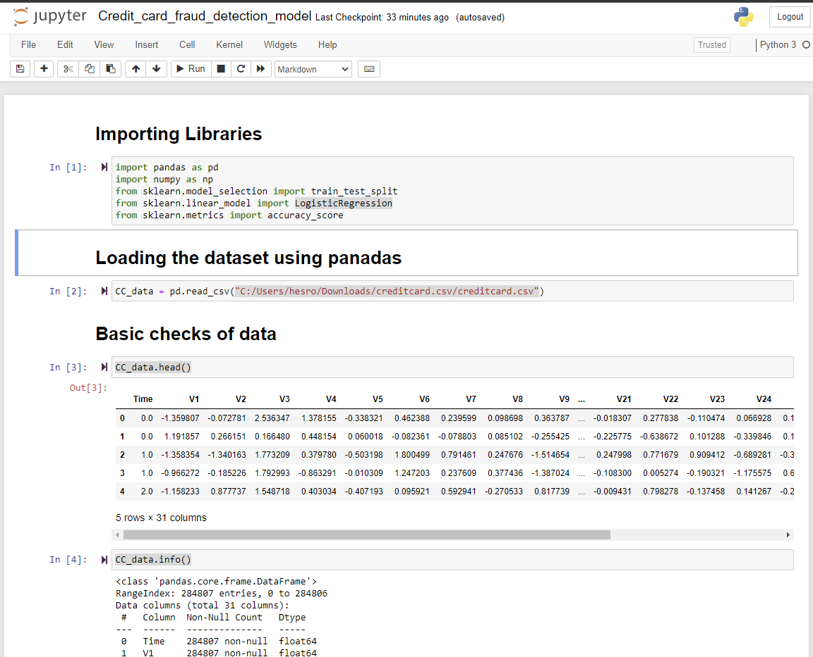
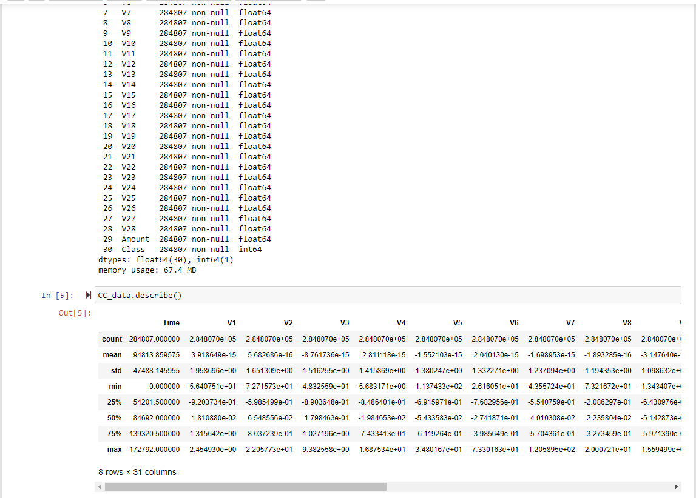
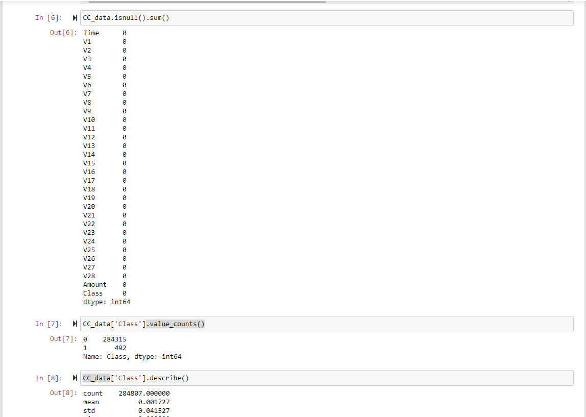
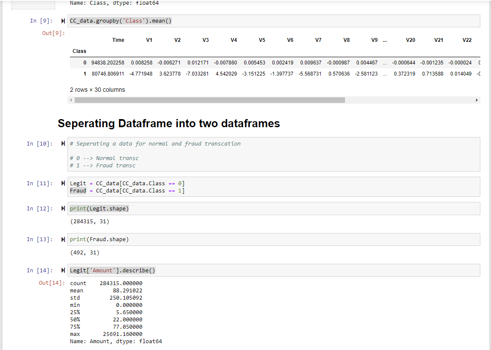
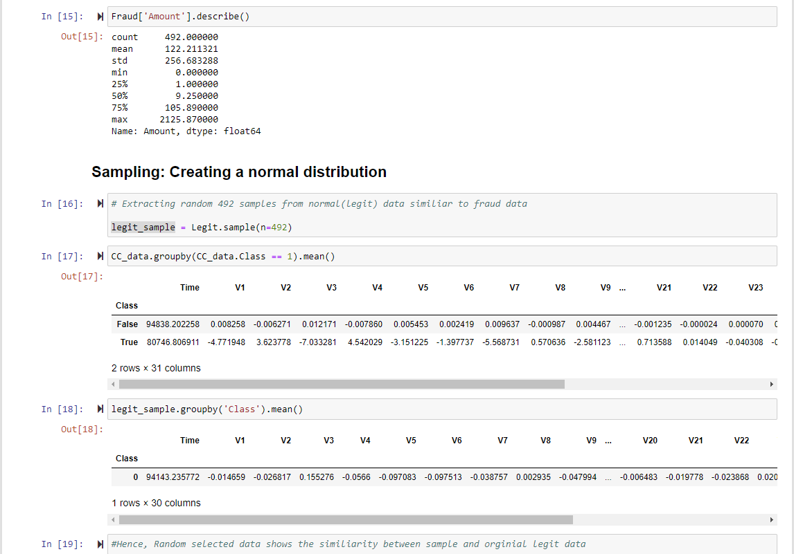
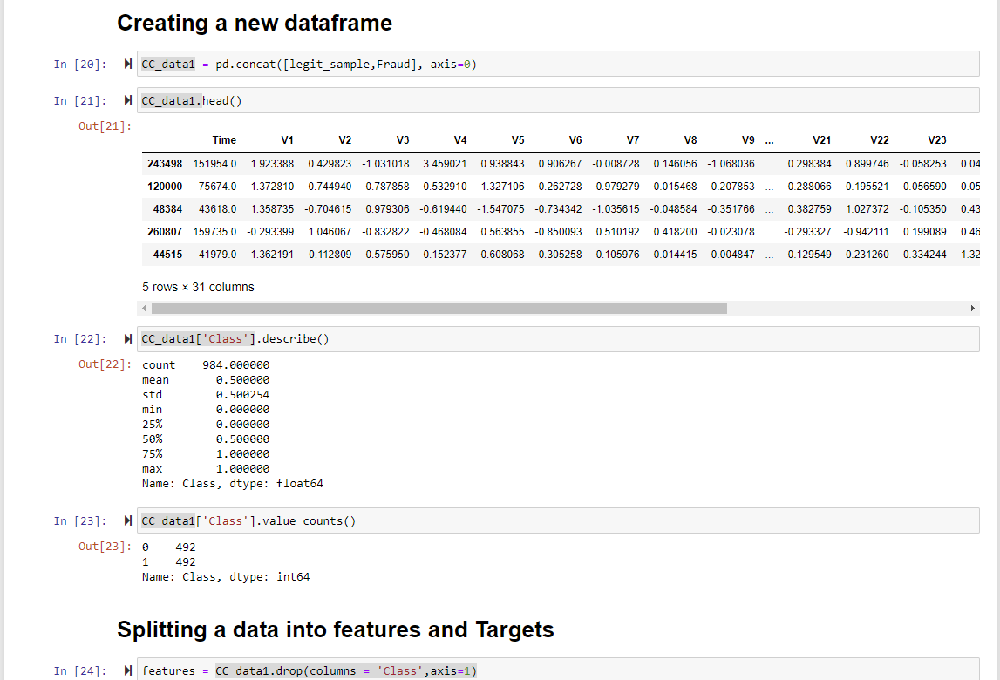
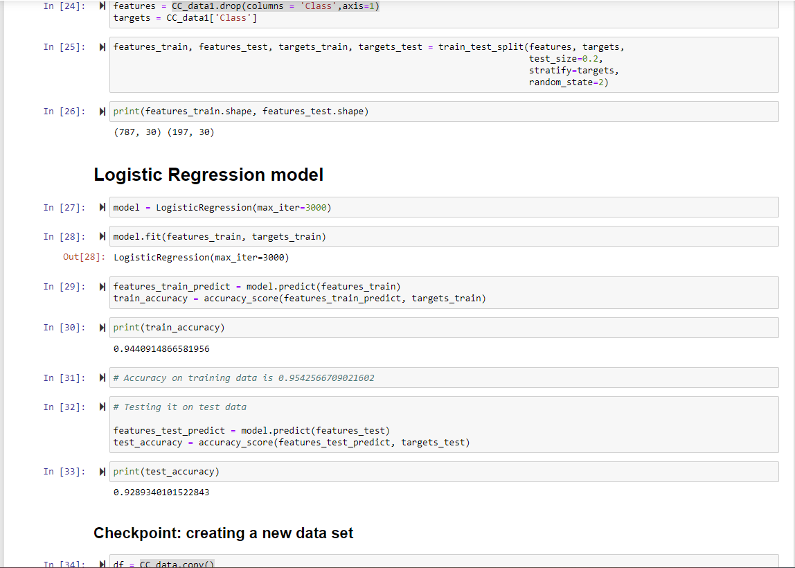
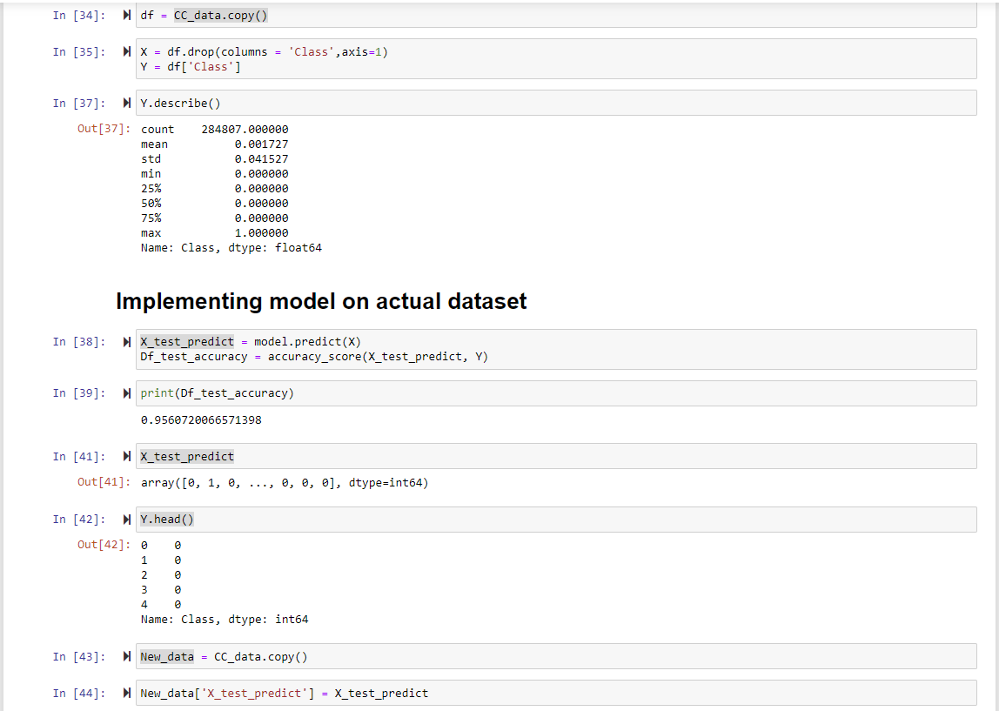
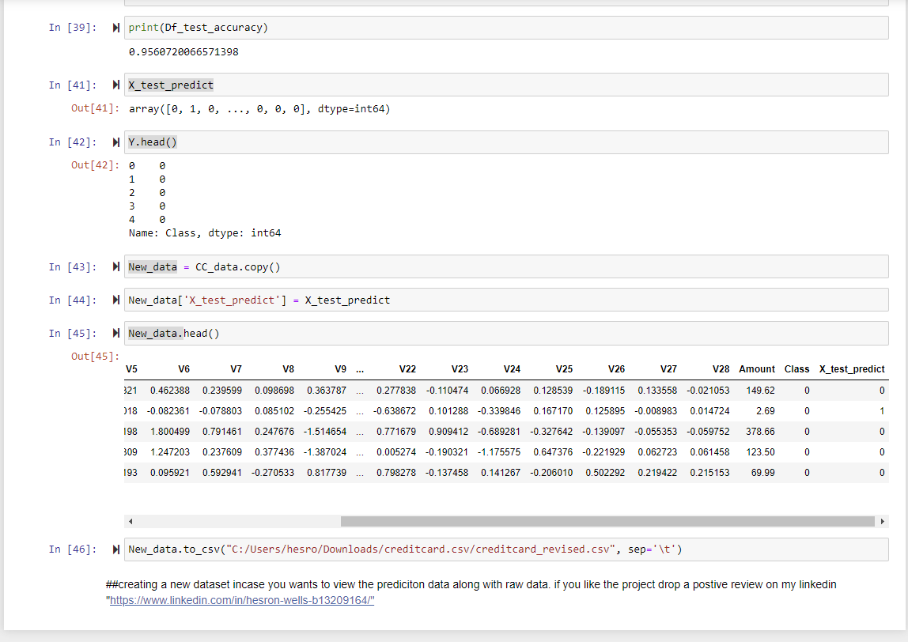

# Credit-card-fraud-detection-model

# Overview

Over the past few years, there has been a significant worldwide increase in the unauthorized use of credit cards

# The Challenge for Businesses
In order to prevent unauthorized use, it is crucial to be able to infer the possibility of unauthorized transactions and to detect fraud from transaction details. We also recognize that the prompt identification of unauthorized transactions is an urgent issue for credit card companies and financial institutions.
They need to be able to quickly understand and analyze the trends of unauthorized spending for each time period and the geographical characteristics of unauthorized use, and to learn how to take concrete preventive measures.

# About Data
The dataset contains transactions made by credit cards in September 2013 by European cardholders. Got it from "https://www.kaggle.com/datasets/whenamancodes/fraud-detection?resource=download"
This dataset presents transactions that occurred in two days, where we have 492 frauds out of 284,807 transactions. The dataset is highly unbalanced, the positive class (frauds) account for 0.172% of all transactions.

It contains only numerical input variables which are the result of a PCA transformation. Unfortunately, due to confidentiality issues, we cannot provide the original features and more background information about the data. Features V1, V2, … V28 are the principal components obtained with PCA, the only features which have not been transformed with PCA are 'Time' and 'Amount'. Feature 'Time' contains the seconds elapsed between each transaction and the first transaction in the dataset. The feature 'Amount' is the transaction Amount, this feature can be used for example-dependant cost-sensitive learning. Feature 'Class' is the response variable and it takes value 1 in case of fraud and 0 otherwise.

Given the class imbalance ratio, we recommend measuring the accuracy using the Area Under the Precision-Recall Curve (AUPRC). Confusion matrix accuracy is not meaningful for unbalanced classification.

